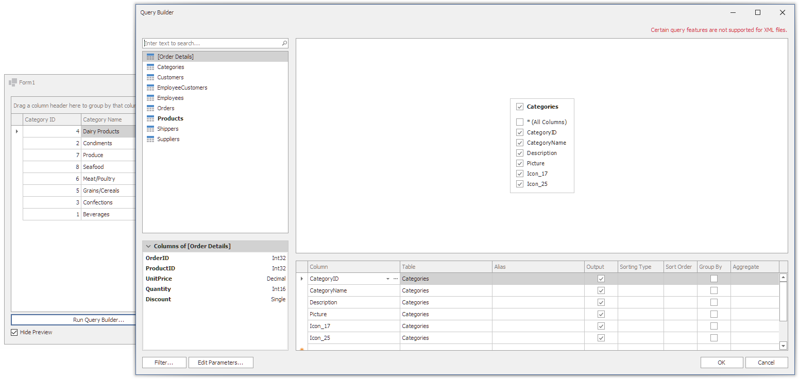

<!-- default badges list -->

<!-- default badges end -->
# Reporting for WinForms - Query Builder

This example shows how you can invoke the Query Builder in a WinForms application. 

Click the **Run Query Builder** button on the form to invoke the [Query Builder](https://docs.devexpress.com/WindowsForms/119019/common-features/data-source-wizard/query-builder). After you add a new query and close the Query Builder window, click **Fill** to populate the **Grid Control** with data from the query.

## Files to Review

* [Form1.cs](./CS/Form1.cs) (VB: [Form1.vb](./VB/Form1.vb))
* [NoPreviewQueryBuilderRunner.cs](./CS/NoPreviewQueryBuilderRunner.cs) (VB: [NoPreviewQueryBuilderRunner.vb](./VB/NoPreviewQueryBuilderRunner.vb))

## Documentation

- [Query Builder](https://docs.devexpress.com/WindowsForms/119019/common-features/data-source-wizard/query-builder)
- [SqlDataSourceUIHelper.AddQueryWithQueryBuilder](https://docs.devexpress.com/WindowsForms/DevExpress.DataAccess.UI.Sql.SqlDataSourceUIHelper.AddQueryWithQueryBuilder.overloads)
- [SqlDataSourceUIHelper.EditQueryWithQueryBuilder](https://docs.devexpress.com/WindowsForms/DevExpress.DataAccess.UI.Sql.SqlDataSourceUIHelper.EditQueryWithQueryBuilder.overloads)

## More Examples

- [How to Use the Query Builder Control in an ASP.NET Core Application](https://github.com/DevExpress-Examples/How-To-Use-Query-Builder-In-Asp-Net-Core)
- [Data Source Wizard – How to customize the standard Query Builder dialog](https://github.com/DevExpress-Examples/Reporting_data-source-wizard-how-to-customize-the-standard-query-builder-dialog-t333785)

<!-- feedback -->
## Does this example address your development requirements/objectives?

 

(you will be redirected to DevExpress.com to submit your response)
<!-- feedback end -->
